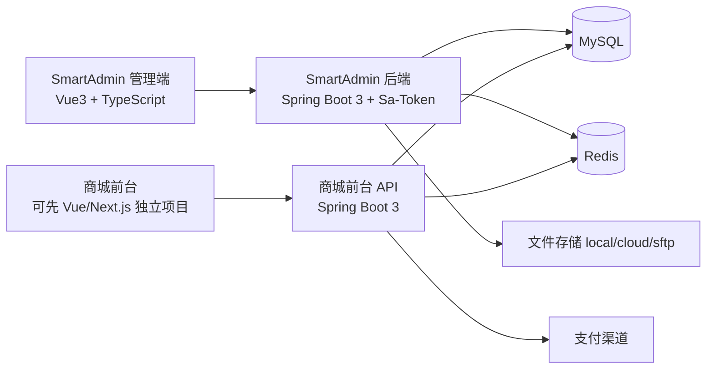
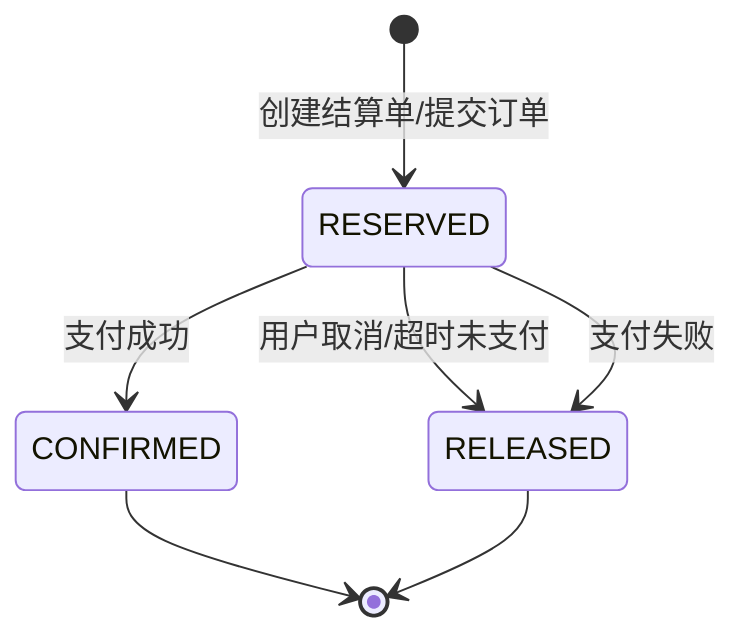
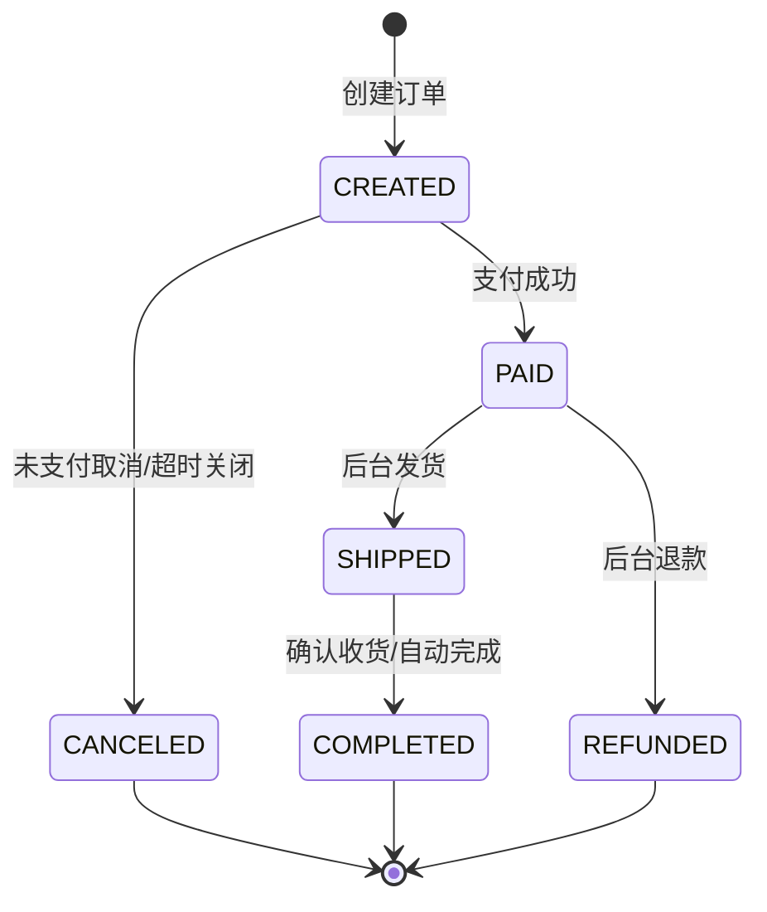

# 独立站电商系统 PRD v4.1 SmartAdmin 落地修订稿

> 本文基于原 v4.0 文档修订，目标是把“Shopify/Shoplazza 对标型独立站系统”收口成当前 `smart-admin` 项目可直接拆分开发的版本。
>
> 原 v4.0 可以继续作为产品蓝图；本文建 议作为开发交付基线，优先替换原文中的第 5 章总体架构、第 7 章 Admin 模块、第 9 章数据库设计、第 10 章 API 契约、第 14 章研发路线图。

---

## 0. 文档信息

| 项 | 内容 |
| --- | --- |
| 版本 | v4.1 SmartAdmin 落地修订稿 |
| 基础项目 | smart-admin |
| 后端基线 | `smart-admin-api-java17-springboot3` |
| 管理端基线 | `smart-admin-web-typescript` |
| Java 版本 | Java 17 |
| Spring Boot 版本 | Spring Boot 3.x |
| 登录鉴权 | Sa-Token |
| 后台返回格式 | `ResponseDTO<T>` |
| 分页返回格式 | `PageResult<T>` |
| 状态 | 可作为第一期拆任务基线 |

---

## 1. 产品定位修订

原文定位为“一套代码，适应百种生意，直连全球买家”。基于 SmartAdmin 落地时，建议调整为：

**基于 SmartAdmin 的自营独立站运营后台 + 可扩展商城前台 API。**

第一期不直接做完整 Shopify 替代品，而是先完成“后台能管商品、库存、订单，前台能浏览、加购、结算、支付”的闭环。

### 1.1 第一阶段边界

第一阶段重点是跑通交易闭环：

| 模块 | 第一阶段处理 |
| --- | --- |
| 多租户 | 数据库预留 `tenant_id`，业务默认单租户 |
| 多语言 | 数据库预留语言字段，MVP 默认 `zh-CN` 或 `en-US` |
| 多币种 | 数据库预留 `currency`，MVP 默认一个币种 |
| 店铺装修 | 先做 Banner、导航、推荐商品等基础配置 |
| 商品中心 | P0 |
| SKU/库存 | P0 |
| 购物车 | P0 |
| 下单 | P0 |
| 支付 | P0，先接一个支付渠道 |
| 订单管理 | P0 |
| 履约发货 | P0，先手动录入物流单号 |
| 退款售后 | P1，可先做后台人工退款记录 |
| 优惠券 | P1 |
| 评论 | P1 |
| 邮件营销 | P1 |
| Meilisearch | P1，MVP 先 MySQL 查询 |

---

## 2. SmartAdmin 技术栈绑定

### 2.1 当前项目选型

| 层 | 采用方案 |
| --- | --- |
| 后端 | Java 17 + Spring Boot 3 |
| 后端模块 | Maven 多模块：`sa-base` + `sa-admin` |
| ORM | MyBatis / MyBatis Plus |
| 数据库 | MySQL |
| 缓存 | Redis |
| 登录 | Sa-Token |
| 接口文档 | Knife4j / OpenAPI |
| 后台前端 | Vue 3 + TypeScript + Ant Design Vue |
| 文件存储 | 复用 SmartAdmin 文件模块，支持 local/cloud/sftp |
| 定时任务 | 复用 SmartAdmin job/support 能力 |

### 2.2 项目目录约定

后端业务代码放在 Java17 版本：

```text
smart-admin-api-java17-springboot3
├── pom.xml
├── sa-base
│   └── src/main/java/net/lab1024/sa/base
└── sa-admin
    └── src/main/java/net/lab1024/sa/admin
```

建议新增商城业务包：

```text
smart-admin-api-java17-springboot3/sa-admin/src/main/java/net/lab1024/sa/admin/module/business/shop
├── cms
├── product
├── sku
├── inventory
├── cart
├── order
├── payment
├── fulfillment
├── customer
├── marketing
└── tenant
```

前端后台页面放在 TypeScript 管理端：

```text
smart-admin-web-typescript/src/views/business/shop
├── cms
├── product
├── inventory
├── order
├── customer
├── marketing
└── setting
```

后台 API 文件放在：

```text
smart-admin-web-typescript/src/api/business/shop
```

### 2.3 Maven 多模块定位

SmartAdmin 当前 Java17 后端是父子模块结构：

| 模块 | 职责 |
| --- | --- |
| `sa-parent` | 父工程，统一依赖版本、插件、模块声明 |
| `sa-base` | 通用基础能力：返回对象、分页、Redis、Sa-Token、文件、字典、配置、日志、验证码 |
| `sa-admin` | 后台启动模块和业务模块，依赖 `sa-base` |

商城业务优先放进 `sa-admin`，不要一开始新建第三个 Maven 模块。等业务稳定以后，如果前台 API 和后台 API 明显分离，再考虑拆 `sa-shop` 或 `sa-storefront` 模块。

---

## 3. 总体架构修订

### 3.1 MVP 架构



### 3.2 接口分层

| 类型 | 路径建议 | 鉴权 |
| --- | --- | --- |
| 后台管理 API | `/shop/admin/...` 或 `/shop/...` | Sa-Token 员工登录 |
| 商城前台公开 API | `/storefront/...` | 可匿名 |
| 商城前台用户 API | `/storefront/user/...` | C 端用户 Token |
| 支付回调 API | `/storefront/payment/webhook/...` | 签名校验 |

后台接口优先沿用 SmartAdmin 风格，不强制使用原 v4.0 的 `/api/v1/admin/...`。

### 3.3 鉴权策略

后台继续使用 SmartAdmin 现有登录：

| 项 | SmartAdmin 约定 |
| --- | --- |
| 登录接口 | `POST /login` |
| 获取登录信息 | `GET /login/getLoginInfo` |
| 退出登录 | `GET /login/logout` |
| Token 方案 | Sa-Token |
| 登录信息缓存 | Sa-Token + Redis/Spring Cache |
| 权限来源 | 菜单权限 + 功能点权限 |
| 接口免登录 | `@NoNeedLogin` |
| 权限校验 | 菜单/按钮权限，必要时用 `@SaCheckPermission` |

商城 C 端用户不建议复用员工登录表。建议新增客户账号体系：

```text
shop_customer
shop_customer_auth
shop_customer_address
shop_customer_login_log
```

C 端 Token 可以二选一：

| 方案 | 说明 | 建议 |
| --- | --- | --- |
| 继续使用 Sa-Token | 统一后端鉴权模型，开发成本低 | MVP 推荐 |
| JWT access/refresh | 更贴近国际电商前台实践 | 后续可切换 |

---

## 4. 后台模块修订

### 4.1 菜单结构

建议在 SmartAdmin 菜单中新增一级菜单：`商城管理`。

| 一级菜单 | 二级菜单 | 功能 |
| --- | --- | --- |
| 商城管理 | 商品管理 | SPU/SKU、上下架、图片、价格 |
| 商城管理 | 类目管理 | 商品分类、排序、显示状态 |
| 商城管理 | 库存管理 | 库存数量、库存流水、预占记录 |
| 商城管理 | 订单管理 | 订单列表、订单详情、改备注、取消订单 |
| 商城管理 | 发货管理 | 发货、物流单号、发货记录 |
| 商城管理 | 客户管理 | 客户档案、地址、订单统计 |
| 商城管理 | 店铺装修 | 首页 Banner、导航、推荐区块 |
| 商城管理 | 营销管理 | 优惠券、折扣码，P1 |
| 商城管理 | 支付配置 | 支付渠道、回调配置 |
| 商城管理 | 店铺设置 | 基础信息、币种、语言、税费、运费 |

### 4.2 权限码建议

权限码要落到菜单和按钮，供前端按钮控制、后端接口控制使用。

| 模块 | 权限码 |
| --- | --- |
| 商品查询 | `shop:product:query` |
| 商品新增 | `shop:product:add` |
| 商品编辑 | `shop:product:update` |
| 商品删除 | `shop:product:delete` |
| 商品上下架 | `shop:product:shelve` |
| SKU 编辑 | `shop:sku:update` |
| 库存调整 | `shop:inventory:adjust` |
| 库存流水查询 | `shop:inventory:record:query` |
| 订单查询 | `shop:order:query` |
| 订单详情 | `shop:order:detail` |
| 订单取消 | `shop:order:cancel` |
| 订单备注 | `shop:order:remark` |
| 发货 | `shop:fulfillment:ship` |
| 退款处理 | `shop:refund:handle` |
| 客户查询 | `shop:customer:query` |
| CMS 配置 | `shop:cms:update` |
| 支付配置 | `shop:payment:config` |
| 店铺设置 | `shop:setting:update` |

---

## 5. API 契约修订

### 5.1 后台统一返回

后台接口必须使用 SmartAdmin 的 `ResponseDTO<T>`。

成功示例：

```json
{
  "code": 0,
  "level": null,
  "msg": "操作成功",
  "ok": true,
  "data": {},
  "dataType": 1
}
```

失败示例：

```json
{
  "code": 10001,
  "level": "user",
  "msg": "参数错误",
  "ok": false,
  "data": null,
  "dataType": 1
}
```

### 5.2 分页统一返回

分页接口统一返回 `ResponseDTO<PageResult<T>>`。

```json
{
  "code": 0,
  "ok": true,
  "msg": "操作成功",
  "data": {
    "pageNum": 1,
    "pageSize": 20,
    "total": 100,
    "pages": 5,
    "list": [],
    "emptyFlag": false
  }
}
```

### 5.3 后台接口命名

建议沿用 SmartAdmin 当前风格：

| 操作 | 路径示例 |
| --- | --- |
| 分页查询 | `POST /shop/product/queryPage` |
| 详情 | `GET /shop/product/get/{productId}` |
| 新增 | `POST /shop/product/add` |
| 修改 | `POST /shop/product/update` |
| 删除 | `POST /shop/product/delete/{productId}` |
| 批量删除 | `POST /shop/product/batchDelete` |
| 上架 | `POST /shop/product/shelve/{productId}` |
| 下架 | `POST /shop/product/unshelve/{productId}` |

### 5.4 表单对象命名

后端 DTO/Form/VO 命名建议：

```text
ProductAddForm
ProductUpdateForm
ProductQueryForm
ProductVO
ProductDetailVO
ProductEntity
```

Service/Dao/Mapper 命名建议：

```text
ProductController
ProductService
ProductDao
ProductMapper.xml
```

---

## 6. 数据库设计修订

### 6.1 公共字段

原文中“通用字段省略”需要改掉。所有业务表建议明确包含：

```sql
tenant_id bigint not null default 1 comment '租户ID',
deleted_flag tinyint(1) not null default 0 comment '删除标识',
create_time datetime not null default current_timestamp comment '创建时间',
update_time datetime not null default current_timestamp on update current_timestamp comment '更新时间',
create_user_id bigint null comment '创建人',
update_user_id bigint null comment '更新人',
version int not null default 0 comment '乐观锁版本'
```

如果第一期不做多租户，也保留 `tenant_id`，默认值为 `1`。

### 6.2 金额字段

订单、支付、退款金额统一使用整数分，不再混用 `DECIMAL(10,2)`。

```sql
pay_amount_cent bigint not null comment '支付金额，单位分',
currency varchar(16) not null default 'USD' comment '币种'
```

适合使用 `DECIMAL` 的字段：

| 字段类型 | 示例 |
| --- | --- |
| 税率 | `tax_rate decimal(10,4)` |
| 折扣比例 | `discount_rate decimal(10,4)` |
| 重量 | `weight decimal(10,3)` |
| 汇率 | `exchange_rate decimal(18,8)` |

### 6.3 核心表清单

MVP 必建表：

| 表 | 用途 |
| --- | --- |
| `shop_tenant` | 租户，MVP 可默认一条 |
| `shop_category` | 商品类目 |
| `shop_product` | SPU |
| `shop_product_sku` | SKU |
| `shop_product_image` | 商品图片 |
| `shop_inventory` | SKU 当前库存 |
| `shop_inventory_record` | 库存流水 |
| `shop_inventory_reservation` | 库存预占 |
| `shop_customer` | C 端客户 |
| `shop_customer_auth` | 客户登录凭证 |
| `shop_customer_address` | 客户地址 |
| `shop_cart` | 购物车 |
| `shop_cart_item` | 购物车明细 |
| `shop_order` | 订单主表 |
| `shop_order_item` | 订单明细 |
| `shop_payment` | 支付记录 |
| `shop_payment_webhook_log` | 支付回调日志 |
| `shop_fulfillment` | 发货记录 |
| `shop_cms_block` | 首页/CMS 区块 |
| `shop_setting` | 店铺配置 |

P1 表：

| 表 | 用途 |
| --- | --- |
| `shop_coupon` | 优惠券 |
| `shop_coupon_customer` | 用户领券 |
| `shop_review` | 商品评论 |
| `shop_refund` | 退款 |
| `shop_after_sale` | 售后 |
| `shop_email_task` | 邮件任务 |

### 6.4 索引约定

所有业务表至少包含：

```sql
index idx_tenant_deleted (tenant_id, deleted_flag)
```

商品建议：

```sql
unique key uk_tenant_product_code (tenant_id, product_code, deleted_flag)
index idx_tenant_status_sort (tenant_id, status, sort)
index idx_tenant_category (tenant_id, category_id)
```

订单建议：

```sql
unique key uk_tenant_order_no (tenant_id, order_no)
index idx_tenant_customer_time (tenant_id, customer_id, create_time)
index idx_tenant_status_time (tenant_id, order_status, create_time)
```

支付回调建议：

```sql
unique key uk_provider_event_id (payment_provider, provider_event_id)
```

---

## 7. 库存预占修订

库存预占是下单并发的核心，MVP 必须写清。

### 7.1 预占流程



### 7.2 规则

| 规则 | 内容 |
| --- | --- |
| 预占 TTL | MVP 默认 15 分钟 |
| 预占时机 | 提交订单时预占，不在加入购物车时预占 |
| 扣减时机 | 支付成功后从可售库存转为已售 |
| 释放时机 | 订单取消、支付失败、超时未支付 |
| 并发控制 | Redis 锁 + 数据库库存条件更新 |
| 幂等控制 | `order_no`、`reservation_no`、支付回调事件 ID |

### 7.3 Redis Key 建议

```text
shop:inventory:lock:{tenantId}:{skuId}
shop:order:idempotent:{tenantId}:{idempotencyKey}
shop:reservation:expire:{tenantId}:{reservationNo}
```

---

## 8. 订单状态机修订

订单、支付、发货、退款不要混成一个状态。建议拆成四组字段：

| 字段 | 示例状态 |
| --- | --- |
| `order_status` | `CREATED`、`CANCELED`、`COMPLETED`、`CLOSED` |
| `payment_status` | `UNPAID`、`PAYING`、`PAID`、`PAY_FAILED`、`REFUNDED`、`PARTIAL_REFUNDED` |
| `fulfillment_status` | `UNFULFILLED`、`PARTIAL_SHIPPED`、`SHIPPED`、`DELIVERED` |
| `after_sale_status` | `NONE`、`REQUESTED`、`PROCESSING`、`FINISHED`、`REJECTED` |

### 8.1 MVP 主流程



---

## 9. Storefront 前台修订

### 9.1 前台项目选择

原文建议 Next.js SSR。基于当前仓库，建议分两步：

| 阶段 | 方案 |
| --- | --- |
| MVP | 先只完成后端 Storefront API，可用简单前台或现有 `smart-app` 验证流程 |
| 正式出海站 | 新建 `smart-storefront`，再选择 Next.js 或 Vue SSR |

不要把商城 C 端页面放进 `smart-admin-web-typescript`。该项目应保持后台管理定位。

### 9.2 Storefront API 返回格式

有两种选择：

| 方案 | 说明 |
| --- | --- |
| 统一 SmartAdmin `ResponseDTO` | 前后端一致，MVP 开发最快 |
| Storefront 独立响应格式 | 更适合开放 API 和国际化错误码 |

MVP 推荐统一使用 `ResponseDTO`，减少前后端适配成本。

---

## 10. 研发路线图修订

### 10.1 Phase 1A：后台基础与商品闭环

周期建议：2 周。

| 任务 | 产出 |
| --- | --- |
| 商城菜单和权限 | 菜单 SQL、权限码、前端路由 |
| 商品类目 | 后端 CRUD、前端列表/表单 |
| 商品 SPU | 后端 CRUD、前端列表/详情/上下架 |
| SKU | 规格、价格、库存、图片 |
| 文件上传 | 复用 SmartAdmin 文件模块 |
| 基础店铺配置 | 店铺名称、币种、语言、LOGO |

### 10.2 Phase 1B：购物车、订单、库存

周期建议：2 周。

| 任务 | 产出 |
| --- | --- |
| C 端客户 | 注册/登录/地址 |
| 购物车 | 加购、修改数量、删除 |
| 库存预占 | 预占、释放、流水 |
| 下单 | 生成订单、订单明细 |
| 后台订单 | 订单列表、详情、备注、取消 |

### 10.3 Phase 1C：支付与履约

周期建议：2 周。

| 任务 | 产出 |
| --- | --- |
| 支付下单 | 创建支付记录 |
| 支付回调 | 签名校验、幂等处理 |
| 支付成功 | 更新订单、确认库存 |
| 发货 | 录入物流单号 |
| 订单完成 | 自动完成或手动完成 |

### 10.4 Phase 2：运营增强

| 模块 | 内容 |
| --- | --- |
| CMS | 首页区块、导航、专题页 |
| 优惠券 | 折扣码、满减、使用限制 |
| 评论 | 评论审核、评分 |
| 多语言 | 文案、商品信息、CMS 内容 |
| 多币种 | 汇率、展示币种、支付币种 |
| 搜索 | Meilisearch 或 Elasticsearch |

---

## 11. Definition of Done

每个模块完成必须满足：

| 项 | 要求 |
| --- | --- |
| 后端 | Controller、Service、Dao、Mapper、Form、VO、Entity 齐全 |
| 前端 | 列表、搜索、表单、新增、编辑、删除、权限按钮 |
| 权限 | 菜单和功能点 SQL 已补充 |
| 接口 | Knife4j 可见，请求/响应字段有注释 |
| 数据库 | DDL、索引、默认数据齐全 |
| 异常 | 使用 `ResponseDTO.error` 或业务错误码 |
| 分页 | 使用 `PageResult<T>` |
| 日志 | 关键业务操作有操作日志或业务日志 |
| 幂等 | 下单、支付回调、库存确认必须幂等 |
| 测试 | 至少覆盖新增、修改、查询、删除/取消、异常参数 |

---

## 12. 原 v4.0 需要替换或降级的内容

| 原内容 | 修订建议 |
| --- | --- |
| 后台 JWT | 改为 Sa-Token |
| `/api/v1/admin/...` | 改为 SmartAdmin 当前接口风格 |
| 自定义统一响应 | 改为 `ResponseDTO<T>` |
| `records,total,page,size` | 改为 `PageResult<T>` |
| Phase 1 同时做全部能力 | 拆为 Phase 1A/1B/1C |
| Meilisearch P0 | 降为 P1 |
| 完整多租户 P0 | MVP 仅预留字段，业务默认单租户 |
| 多语言多币种 P0 | MVP 预留字段，正式站点前再完成 |
| 完整 CMS 页面编辑器 | MVP 做基础区块配置 |
| 自动化邮件营销 | P1 |
| 评论系统 | P1 |
| 完整售后系统 | P1 |

---

## 13. 给前端开发者的落地说明

你主要做前端时，可以按这个顺序学习和开发：

1. 先看 `smart-admin-web-typescript/src/api`，理解接口封装。
2. 再看 `src/views/system/role`、`src/views/system/menu`，理解 SmartAdmin 页面组织方式。
3. 商城后台页面优先仿照已有列表页和表单页，不要一开始重写组件体系。
4. 权限按钮要接 SmartAdmin 的菜单/功能点权限。
5. 后端接口统一看 `ResponseDTO` 和 `PageResult`，前端不要按原 v4.0 的 `records` 格式写死。
6. 每个业务模块先做列表，再做新增/编辑弹窗，最后补详情页和批量操作。

---

## 14. 第一批开发任务建议

建议第一批只开这些任务：

| 序号 | 任务 | 前端 | 后端 |
| --- | --- | --- | --- |
| 1 | 商城菜单和权限初始化 | 路由/菜单确认 | 菜单 SQL |
| 2 | 类目管理 | 类目树、表单 | CRUD |
| 3 | 商品管理 | 列表、表单、上下架 | SPU CRUD |
| 4 | SKU 管理 | 规格编辑、SKU 表格 | SKU 生成/保存 |
| 5 | 图片上传 | 商品图上传 | 复用文件模块 |
| 6 | 库存管理 | 库存调整弹窗 | 库存表/流水 |
| 7 | 订单列表 | 列表、筛选 | 查询接口 |
| 8 | 订单详情 | 详情页 | 详情聚合 |

完成这 8 个任务后，再开始购物车、下单和支付。这样风险最低，也最适合边学后端边做。

